# Buck Converter Roman Black #
buck converter ini mengacu pada referensi https://romanblack.com/smps/a01.htm
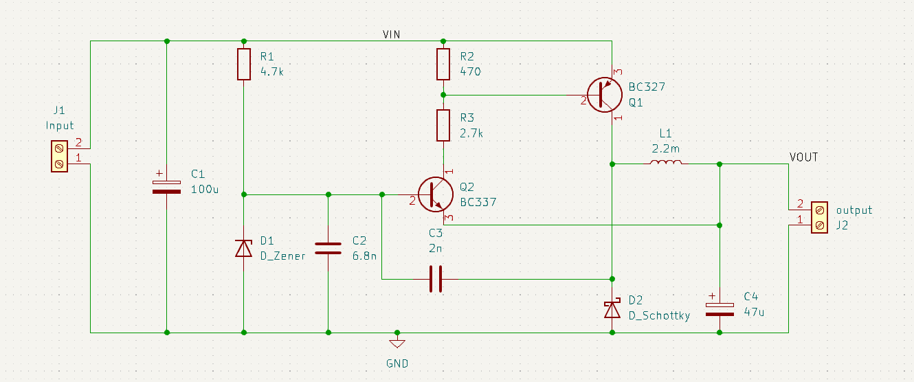
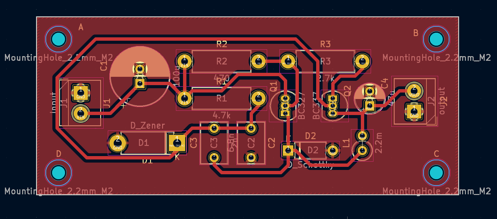
## Percobaan pada Breadboard ##
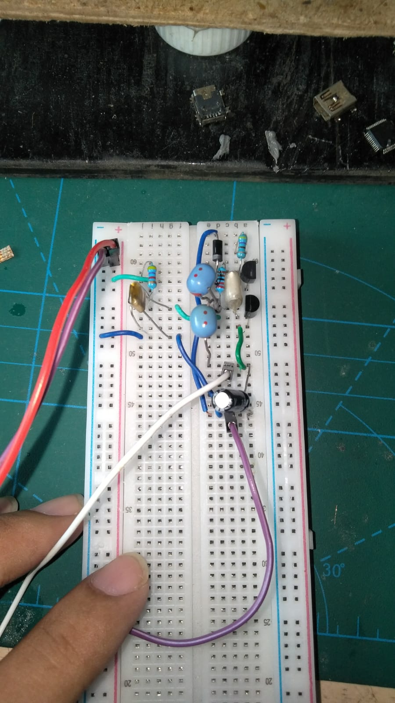
### Beban 100k ###
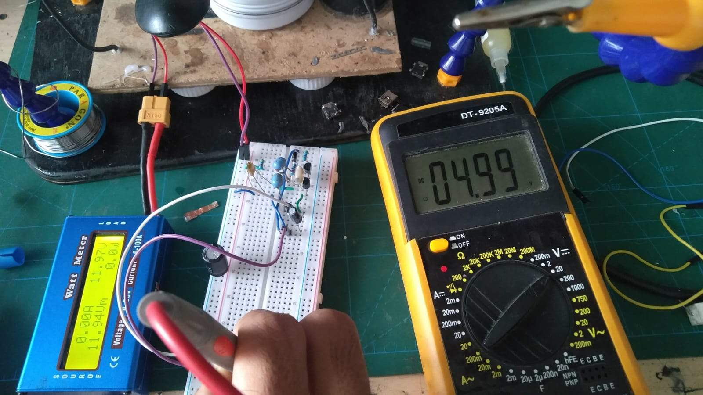
### Beban 75k ###
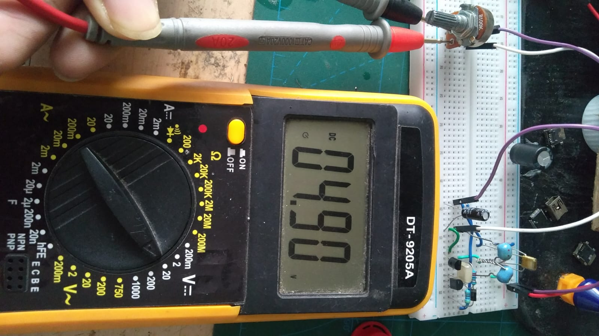
### Beban 50k ###
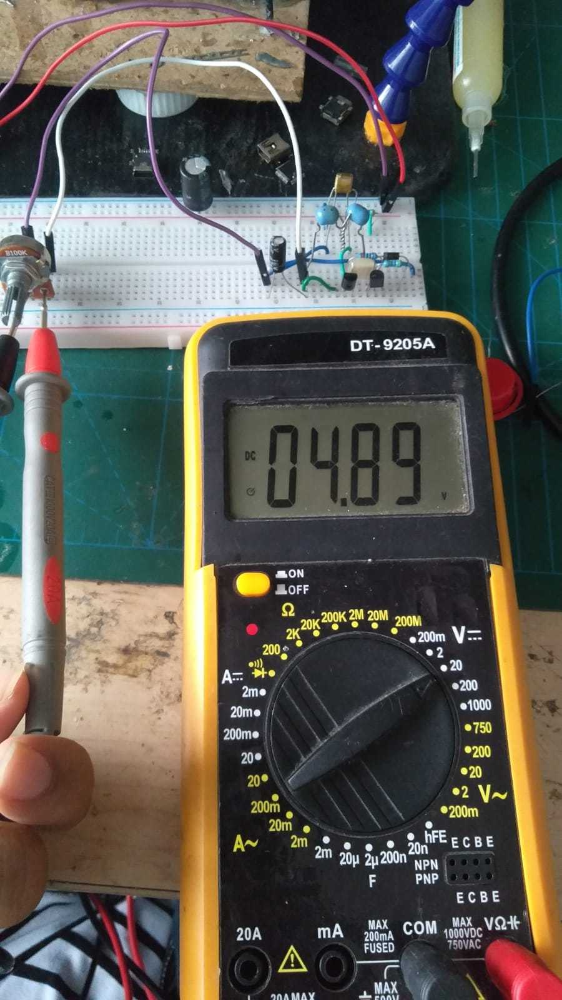
### Beban 25k ###
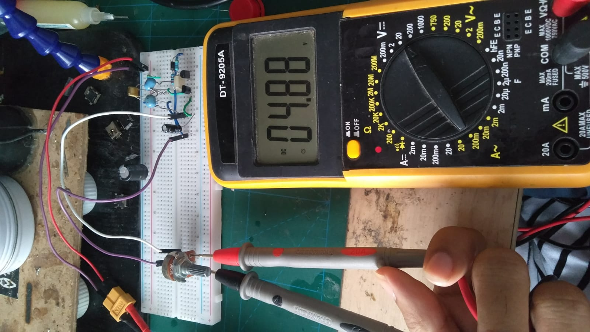
### Beban 10k ###
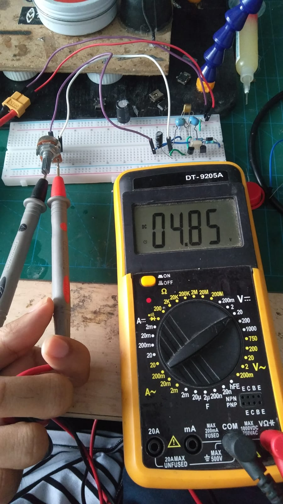
### Beban 5k ###
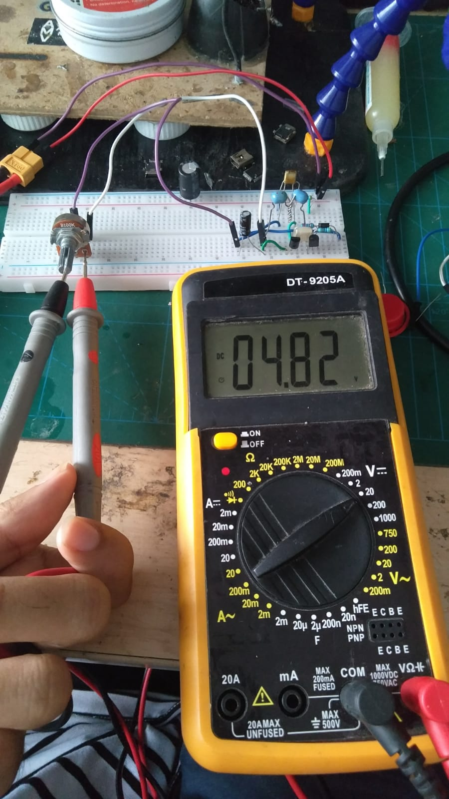
### Beban 2k ###
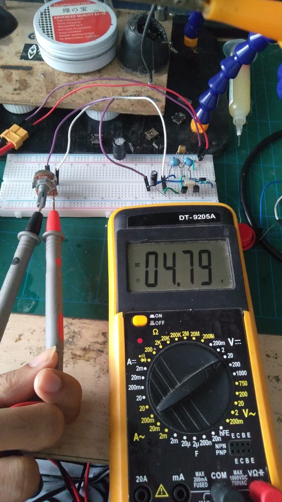
### Beban 1k ###
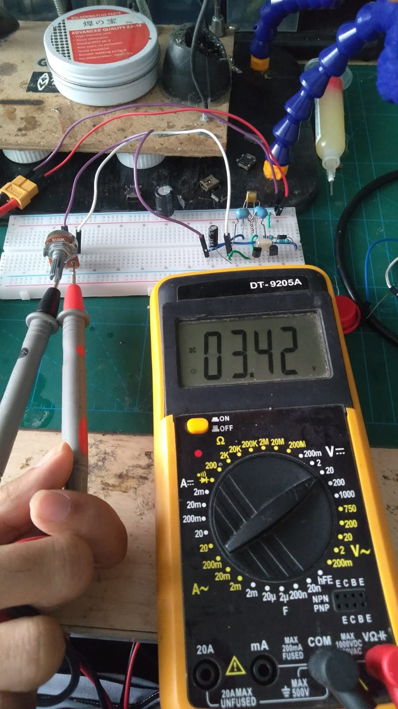
### Beban 100 ohm ###
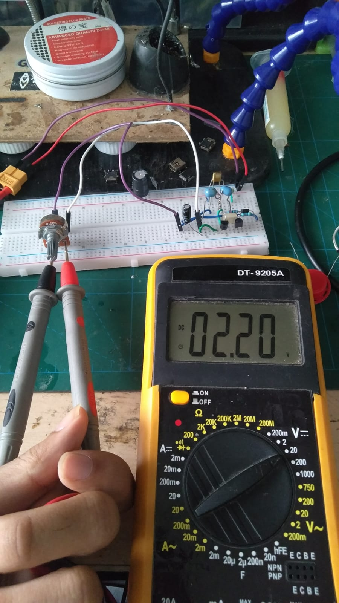